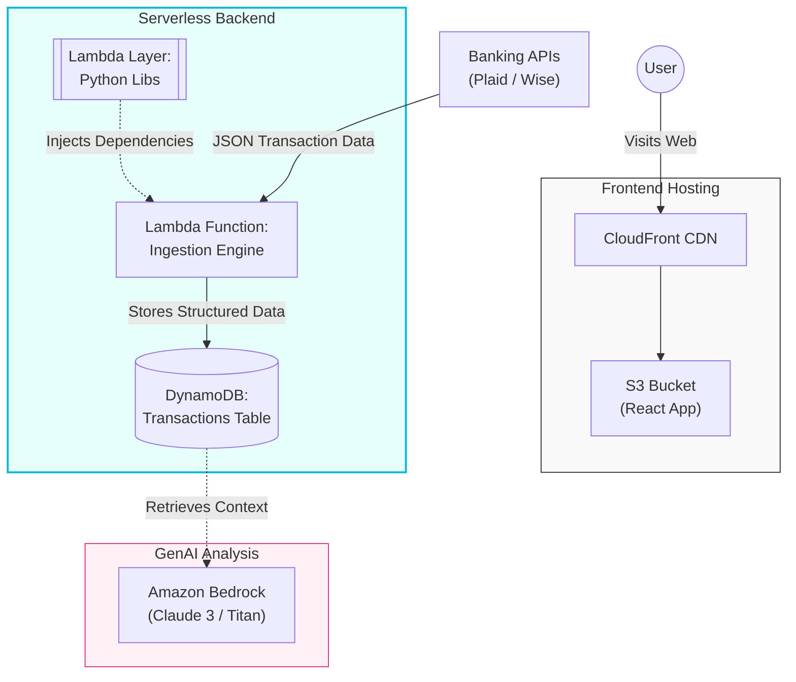

# 🏦 AI Financial Agent - System Architecture

### Project: #100DaysOfCloud Challenge
**Day 23 Milestone:** Banking Integration & Serverless Ingestion.

---

## 🏗️ Architecture Diagram

## 🛠️ Tech Stack & Components
Ingestion Engine (Python 3.13):

AWS Lambda: Executes the logic to fetch data securely.

Lambda Layers: Custom package containing plaid-python and requests libraries.

Environment Variables: Stores API Keys securely (non-hardcoded).

Storage (NoSQL):

Amazon DynamoDB: Stores transaction records with partition keys for fast retrieval.

External Integrations:

Plaid Sandbox: Simulates banking flows and realistic data for UI testing.

Wise API: Connects to real production accounts for personal finance tracking.

AI Analysis (Next Step):

Amazon Bedrock: Will consume data from DynamoDB to generate financial insights using Generative AI.